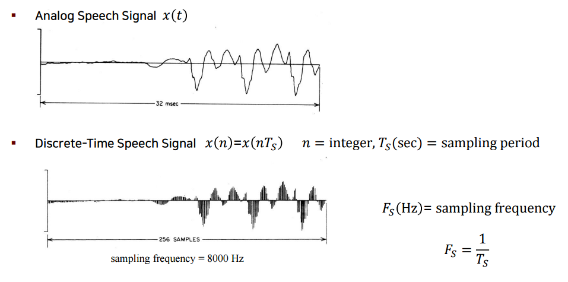

# 4. 음성신호 모델링

## 1. Sampling and Quantization

자연계에 존재하는 모든 시그널은 아날로그이기 때문에, 아날로그 시그널을 디지털 시그널로 변환시키는 과정이 필요하다. 그리고 아날로그를 디지털로 변환하기 위해서는 Sampling과 Quantization 을 거쳐야 한다.

#### Signal Processing

1. 정보원으로부터 센서를 통해서 측정 \(대부분 아날로그\)
2. 아날로그 시그널을 디지털 시그널로 변환
3. 신호가 갖고 있는 여러 좋은 특성들을 추출한 후 변환하여 유용한 정보를 만들어 냄

#### Analog-to-Digital Conversion

Sampling

1. 아날로그 시그널을 디지털 시그널로 변환하기 위해 우선 샘플링을 통해 discrete한 time 시그널로 변해준다. 이때, 샘플링을 하는 period를 Ts 라고 하자. 그렇다면 sampling frequency는 sampling period의 역수가 된다.

2. continuous time의 시간 지수가 t였다면, discrete time의 시간 지수는 정수배인 nTs가 된다. 여기서 Ts를 삭제하고 n만 사용하여 discrete time 시그널의 시간 축을 표시해준다. 따라서, discrete time 시그널은 x\(n\)으로 표시가 된다.

Quantization

1. continuous amplitude를 discrete amplitude로 변환해줄 때, 몇개의 discrete value를 사용해서 변환해주는가 하는 것은 몇 비트의 정보를 사용하는가에 따라 달린다.

2. n bits를 사용한다면 2^n개로 구분을 하게 된다. 이에 따라 아날로그 시그널의 크기가 어느 구간에 속하는지를 확인하여 discrete amplitude로 할당한다.

## 2. Linear Time-Invariant System

## 3. Frequency Domain Representation

## 4. Nyquist Sampling

## 5. Frequency Domain Characteristics of Speech

## 6. Spectogram

