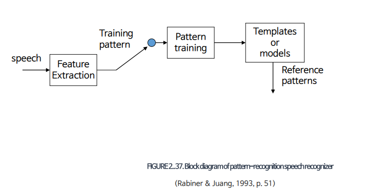
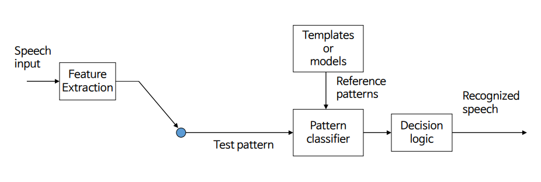
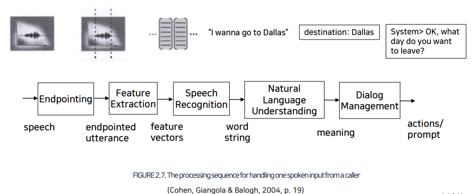
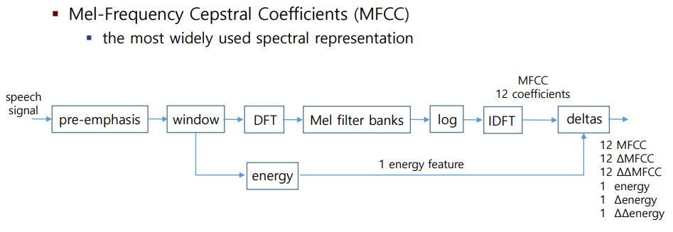
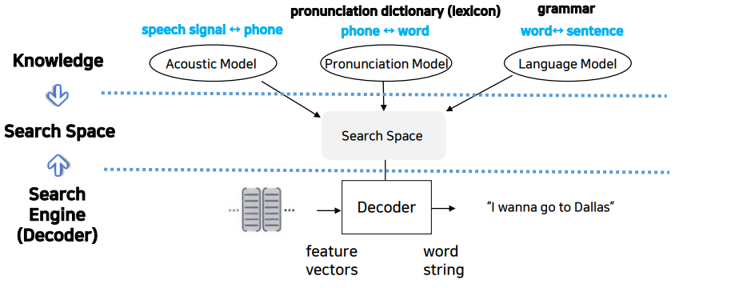

# 6. 패턴 · 음성인식 기본 개념

## Pattern Recognition

### Introduction

* 패턴인식은 음성인식, 얼굴인식, 지문인식, 홍채인식 등 여러 분야에서 사용된다.
* Pattern = data structures of features
  * feature: 인식 대상을 설명하는 특징
  * raw data가 아닌 특징이라는 요약 정보를 사용해 인식

### How?

#### 1. Training

1. 음성 입력을 받는다
2. 특징을 추출하고 특징 벡터열\(training pattern\)을 만든다 
   * 25msec 구간의 프레임이 10msec씩 이동하며 입력된 음성 분할한다
     * 겹치는 구간이 15msec이므로 음성을 불연속적으로 나누었을 때 발생하는 주파수 손실 문제를 해소할 수 있다. 
     * 25msec는 사람이 발화하는 음소 중 가장 짧은 것보다도 더 짧으므로 한 프레임에는 한 음소의 특징만이 들어가게 된다.
     * 각 프레임에서 39차원의 특징을 추출해 feature vector를 만든다.
     * feature vector들을 모으면 feature vector sequence가 형성된다.
3. training pattern에 머신러닝 알고리즘을 통해 reference pattern들 만든다

#### 2. Test

1. 음성 입력을 받는다
2. 특징을 추출하고 특징 벡터열\(test pattern\)을 만든다 
3. reference pattern과 비교해 매칭 스코어를 구한다.
4. 매칭 스코어를 최대로 하는 reference pattern의 인덱스를 출력한다. 

### Pruning

* 인공지능의 일반적인 문제 해결 방법은 가능한 모든 솔루션\(search space\)을 전부 생성한 뒤 그 중 최고의 솔루션을 선택하는 것이다. 하지만 이렇게 할 경우, 패턴 인식에 필요한 시간이 매우 커져 결과를 도출하는 것이 사실상 불가능해진다.
* 예를 들어 단어가 1만개 존재하는 세상에서 어 4개로 이루어진  sequence를 인식해야 한다고 가정해보자. 이를 위해 모든 솔루션을 생산한다면 1만^4 개의 솔루션을 패턴 매칭해야 한다.
* 이를 해결하기 위한 기법이 pruning이다. pruning이란 가능한 모든 솔루션 중 최고의 솔루션에 해당할 확률이 높은 포텐셜 솔루션을 선별하는 것이다. 포텐셜 솔루션에 대해서만 패턴 매칭을 수행한다면 연산에 필요한 시간을 줄일 수 있다.

## Speech Recognition

### 1. Endpointing \(끝점검\)

* 음성 인식기에 입력되는 음성은 silence + signal + silence의 형태로 구성이 되어있다.
* 끝점검출기에서 신호의 시작점과 끝점을  찾아내어 신호에 해당하는 구간만을 input pattern으로 변환할 수 있게 해준다.

### 2. Feature Extraction \(특징 추출\)

* input pattern에서 특징 추출을 해 특징 벡터열을 만든다.

* 1980년대 이후 가장 많이 사용되는 음성 특징은 Mel-Frequency Cepstral Coefficients이다.
* pre-emphasis란 음성 신호 전달 과정에서 감소된 고주파 성분값을 키워주어 음성의 resolution을 높이는 것이
* window fuction이란 음성신호의 프레임들이 부드럽게 이어질 수 있도록 프레임 가운데 신호의 크기는 유지하되 경계 부분의 크기를 줄이는 것이다. 가장 많이 쓰이는 window는 Hamming window이다.
* DFT : Discrete Fourier Transform
* Mel Filter Bank: 인간은 1000HZ 이상의 고주파 성분에 대해서 둔감하게 반응한다는 성질을 반영한 것이다. 1000 HZ 이하의 저주파 성분에서는 선형, 즉 10개의 필터를 이용해 정보를 수집하지만 1KHZ 이상의 고주파 성분에서는 로그 스케일에 따라 둔감하게 정보를 수집하는 것이다. 
* 이렇게 도출된 스텍트럽에 log magnitude spectrum을 취하고 inverse DFT를 적용해 출력된 것이 Cepstrum이다.

### 3. Speech Recognition \(음성인식\)

* 음성인식은 특징 벡터열을 input으로 받고 이에 해당하는 문장인 word string 을 output으로 출력하는 음성인식기를 기반으로 수행된다. 이 때, 음성인식기를 search engine\(decoder\) 라고 부른다. 
* 음성인식에서 가능한 솔루션들의 집합인 search space는 Acoustic model, Pronunciation Model, Language Model을 바탕으로 형성된다.
* 음성인식기는 입력된 특징 벡터열을 search space내의 솔루션과 비교해 가장 큰 매칭 스코어를 도출하는 답을 출력하는 것이다.

### 4. Natural Language Modeling \(자연언어 이해 모\)

* 이 단계에서는 입력된 word string으로부터 의미를 추출한다. 
* 의미를 표현할 때에는 slot-and filler 방법을 주로 사용한다.

### 5. Dialogue Management \(대화 처리 모\)

* 입력된 문장의 의미를 기반으로 대화를 이어나갈 수 있게 시스템 액션을 생성한다.
* 예를 들어, 여행을 가고 싶다는 말을 사용자가 했다면 어디로 가고 싶냐는 시스템 액션을 생성해 음성 합성기에 입력으로 넣는 것이다.

