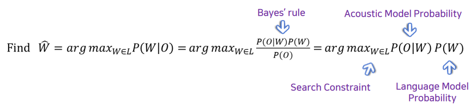
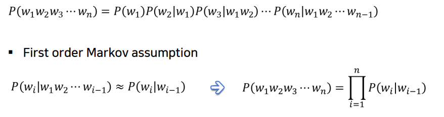
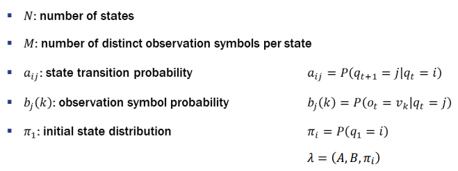

# 7. 음성인식 모델

## 음성인식 문제의 수학적 풀이   

* 화자가 말하고자 하는 문장을 W = w1, w2, ... wn 라 하자.
* O는 W가 소리로 구현된 acoustic input, 즉 observation이다.
* W 햇은 청자가 인식하는 문장시퀀스이다.
* 음성인식은 acoustic input이 특정 문장에 해당할  확률을 계산한 후 가장 큰 확률값을 출력하는 문장 W를 답으로 제시하는 것이다.
* 이 때, 조건부확률 P\(W\|O\)는 우리가 최종적으로 구하고자 하는 확률이기 때문에 이를 구하기 위해서는 베이즈 정리를 사용해 식변환을 해야 한다. 
* 변환 식을 바탕으로 최대값을 도출하는 W를 찾는 문제에서 변수는 W이다. 따라서 P\(O\)는 비례 상수이므로 삭제한다.
* P\(O\|W\)를 Acoustic Model Probability라 한다.
* P\(W\)를 Language Model Probability라 한다.
* search space에서 potential solution을 선별할 때 적용하는 search constraint\(제약조건\)은 문법이다.

## Markov Assumption

* W1부터 Wi-1까지 일어났을 때 Wi가 일어날 확률을 Chain Rule을 활용해 계산한다면 매우 복잡하다.
* First order Markov assumption은 Wi의 확률이 오직 Wi-1의 확률과 관련이 있으며 그 이전의 W들과는 무관하다고 가정하는 것다.
* 이렇게 가정하면 계산이 매우 간결해진다.

## Hidden Markov Model

* Markov Assumption을 사용해 hidden state sequence를 찾아낸다.
* Hidden state sequence란 화자의 머리 속 숨겨진 sentence sequence를 말한다.  앞서 언급한 W =  w1, w2, ... wn 에 해당한다. 이 때 w1, w2 등을 hidden state q1, q2라 한다. 
* 이 모델에서 음성인식이 observation state sequence를 \(o1, o2 ...\) 바탕으로 hidden state sequence\(q1, q2...\)를 찾는 것이다.
* 이 모델에서는 세가지 가정을 한다.
  1. qt는 qt-1에게 영향을 받지만 그 이전 state로부터는 영향을 받지 않는다 \(first order markov assumption\)
  2. qt와 ot는 correlation이 있다.
  3. ot와 ot-1은 독립이다. 따라서 qt와 ot-1도 독립이다 \(correlation이 없다\).

## N-gram Model

* 다음에 나올 단어의 예측을 직전 n-1개의 단어에만 의존해서 구하는 것이다. 
* 예를 들어 Tri-gram model에서 'I want to go to \_\_\_\_. '라는 문장의 빈칸에 들어갈 단어를 구할  'go to'만 이용한다.
* 이와 같은 확률 기반의 언어 모델을 사용할 때 확률은 관측 빈도수에 따라 부여되기 때문 관측이 되지 않은 sequence은 확률값 0이 부여된다.  이 때, 관측 되지 않은 sequence가 정말 존재할 수 없는 sequence인지 아니면 우리의 training data가 불완전해서 관측되지 않은 것인지 구별이 불가능하다는 문제가 있다.

## 한국어 발음의 불규칙성으로 인한 문

* 신라는 \[실라\]로 발음된다.
* 명사 감기과 동사 감기\[감끼\]는 발음이 다르다.
* 이 문제를 해결하기 위해서는 표제어가 어떤 형태소 성분으로 구성되어 있는지, 형태소와 형태소의 결합관계가 어떠한지에 대한 모델이 필요하다.

