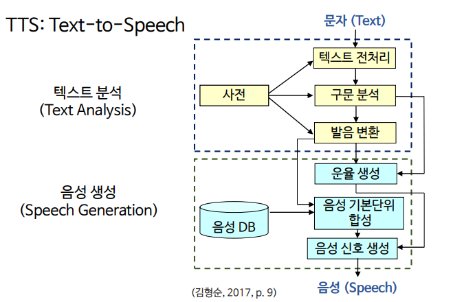
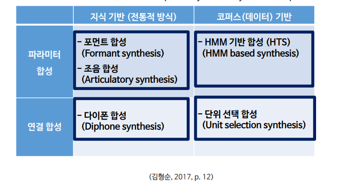
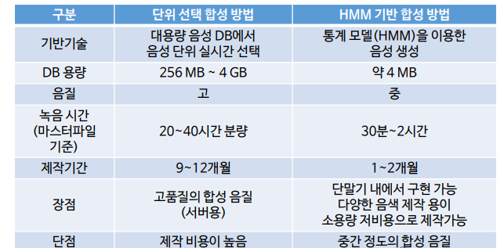
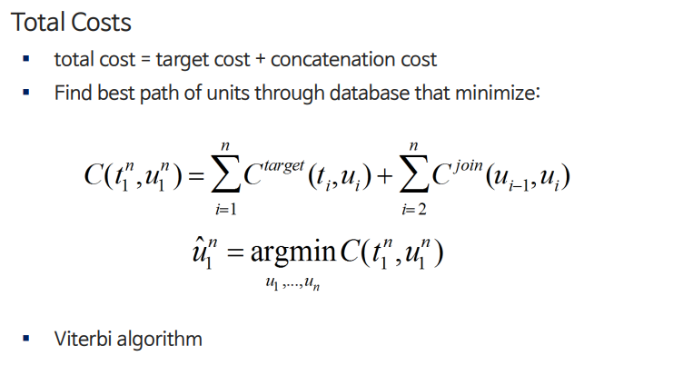

# 8. 음성합성

## 디지털 음성과 합성 음성의 비

* 디지털 음성 \(Digitized Speech\) 
  * 단어, 구, 문장 등을 녹음한 후 편집해 재생
  * 음질 
  * 정해진 문장, 또는 제한된 조합의 문장만 생성 가능
* 합성 음성 \(Synthesized Speech\) 
  * 음소 조각들을 합성해 생성
  * 음질이 떨어짐 
  * 어떠한 문장이라도 생성 가능 
  * Text-To-Speech\(TTS\) 합성이라고 부름

## 음성 합성 시스

### 1. Text Analysis\(텍스트 분\)

* 텍스트 전처리: 숫자. 기호, 약어 등을 읽을 수 있게 처리한다.
* 구문분석: 문장구조, 품사, 수식관계 등을 분석해 운율 생성에 필요한 정보를 수집한다.
* 발음변환: 구개음화 등 음운변화 현상을 반영한

### 2. Speech Generation \(음성 생\)

* 운율 생성: 고저, 장단, 쉼, 강약과 같은 운율 정보를 넣는다.

## 음성 합성 방법

### 지식기반 합성 방

#### Formant Synthesis\(포먼트 합성\)

* 1970년대에 활발하게 사
* formant: 구강 내 공명 주파수
* 포먼트 변화 규칙을 통해 합성음 생성
* EX. MIT가 개발한 DECtalk

#### Diphone Concatenative Synthesis \(다이폰 합성\)

* 1980, 90년대에 활발하게 사
* 연결합성: 음성의 단위를 편집해서 합성하는 방
* diphone: 한 음소의 중심에서 다음 음소의 중심까지의 단
* 동시조음현상 반

### 코퍼스 기반 합성 방

#### 단위 선택 합성 방

#### Hidden Markov Model 기반 합

* 화자적응 기

  * 많은 training speakers의 목소리를 모델링해 average-voice model을 만든 후 소수의 target speaker 음성 데이터에 adaptation시켜 그 speaker의 음색으로 음성 합성을 하는 기
  * 다양한 화자의 목소리 및 감정 표현이 가능하

